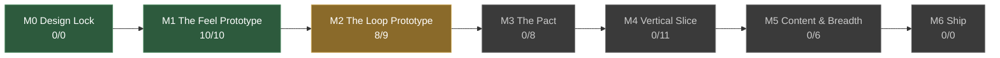

<!-- GENERATED BY tools/status.py — DO NOT EDIT BY HAND -->

# Project SHE — Status

<!-- generated-stamp --> _Regenerated 2026-08-17_

**Current milestone: M2 — The Loop Prototype**

> **Gate:** `pending` — a playtester **voluntarily abandons loot to survive**, then talks about it afterwards. That's the whole game in one moment. If it doesn't happen, the pressure system is wrong, not the content.

`18/44` tasks complete across the roadmap. Progress is **scope covered, never time remaining** (ADR-034).

## Milestones

| | Milestone | Progress | Done | Gates |
|---|---|---|---|---|
| ✔ | **M0** Design Lock | — | ✔ | `EXIT` passed 2026-08-14 |
| ✔ | **M1** The Feel Prototype ×1 | `██████████` | 10/10 | `EXIT` passed 2026-08-16 |
| ▶ | **M2** The Loop Prototype ×1.5 | `█████████████░░` | 8/9 | `EXIT` pending `COOP` pending |
|  | **M3** The Pact ×2 | `░░░░░░░░░░░░░░░░░░░░` | 0/8 | `EXIT` pending `COOP` pending |
|  | **M4** Vertical Slice unsized | `░░░░░░░░░░░░░░░░░░░░` | 0/11 | `EXIT` pending |
|  | **M5** Content & Breadth unsized | `░░░░░░░░░░░░░░░░░░░░` | 0/6 | `EXIT` pending |
|  | **M6** Ship not broken down | — | — | _no gate_ |

## Blockers

_None. Sequencing is clean._

## Warnings

| Check | Note |
|---|---|
| `untuned` | DES-009 is fully implemented (M1-T01, M1-T02) but still has 4 ⟨tune⟩ marker(s) |
| `untuned` | TEC-001 is fully implemented (M1-T07, M1-T08) but still has 1 ⟨tune⟩ marker(s) |

## Tasks

### M1 — The Feel Prototype

- ✔ `M1-T01` First-person controller: walk, sprint, crouch, stamina, weight affecting movement. *Unjuiced per Swink; couplings measured, encumbrance signed off 2026-08-15* `DES-009` `DES-005`
- ✔ `M1-T02` One weapon, one enemy, hit reactions, death. *Built with the awareness ladder (ADR-072); anatomy and telegraph measured. Signed off 2026-08-16 on DES-009's actual M1 criterion — swinging and connecting feel decent unjuiced. The avoidance question moves to `M2-T02`, where there is finally something worth declining (ADR-079)* `DES-009` `DES-013`
- ✔ `M1-T03` One hand-built room set, no generation. *A cycle, not a corridor: two routes to the exit, one enemy-free, both asserted by `--route-probe`. The Prize costs -18% walk speed and triples your audible radius, so the Guardian room poses a real question. Signed off 2026-08-16* `DES-015`
- ✔ `M1-T04` Weight & Clamor as visible debug numbers. *Layer 1 radius, not the M2 field (ADR-073); readout plus an audible-radius ring, since TEC-001 calls this untunable blind* `DES-005`
- ✔ `M1-T05` **Two players over localhost**, host-authoritative (`TEC-004`). *The peer owns its body, the host owns every consequence (ADR-082) — `TEC-004` asked for prediction and banned reconciliation, which cannot both hold. A two-process smoke test runs in the pre-commit sweep* `TEC-004`
- ✔ `M1-T06` **Networking spike test — go/no-go:** 4 peers, ~150 synchronized entities. This validates or kills the whole Godot high-level-multiplayer approach, and it must happen now rather than at M4. **GO (ADR-068)** — CPU never the constraint; bandwidth is, and relevance filtering is load-bearing `TEC-004`
- ✔ `M1-T07` **Determinism harness in CI**: same seed on two processes → identical layout hash. *Built before the generator on purpose — written first it is a specification `M4-T01` must satisfy, written after it only ratifies whatever the generator already does* `TEC-001` `DES-015`
- ✔ `M1-T08` **Godot project skeleton** — folder layout, the ≤6 autoload budget enforced in CI (ADR-066), Forward+, naming and GDScript conventions, CI for the doc index and the dashboard. *The determinism harness is `M1-T07`'s deliverable, not this one (ADR-067)* `TEC-002` `TEC-001`
- ✔ `M1-T09` **Ink shader spike** — grey boxes, outlines and boil only. **Go/no-go**: if it is not ~70% convincing, commit to flat quantised shading and never build the other path (ADR-062, ADR-064). **GO (ADR-070)** — pass costs ≈0.4–0.6 ms at 1080p; flat quantised shading is not built `ART-005`
- ✔ `M1-T10` **Shared humanoid rig — seven sockets, authored to the collider** (ADR-080). `sock_head` `sock_hand_r` `sock_hand_l` `sock_back` `sock_hip_r` `sock_hip_l` `sock_shoulders`; Body and Arms are *skinned*, not socketed (ADR-057). Built to 1.80 m standing, 0.35 m radius, 1.62 m eye — the dimensions `M1-T01` was signed off against. Must exist before *any* character work; adding a socket later means re-exporting every mesh `ART-004` `DES-020`

### M2 — The Loop Prototype

- ✔ `M2-T08` **Data schema base resources** — `ItemResource` + trait resources, stable string IDs, **plus the CI validator**. Built with the first ten resources, not the first thousand. *Moved ahead of `M2-T01` by ADR-083. `WieldableTrait` only — the other six traits describe systems that do not exist yet. Validator implements the rules whose data exists and no others (ADR-084): a rule against an empty folder is a green tick that cannot fail. Item text is translation keys (ADR-084)* `TEC-006`
- ✔ `M2-T01` Loot with weight and clamor; **one inventory: grid-based, weighted, real-time** (ADR-040, reaffirmed by ADR-083 — decided, not a prototype fork). *6×5 grid ⟨tune⟩, `ItemInstance` + `ItemCatalogue`, host-validated pickup and drop, blockout bag screen. The room set's Prize is `glt_altar_plate` and its hand-rolled loot path is deleted. Carried clamor is a decay floor, so dropping loot buys silence back (ADR-087)* `DES-008` `DES-005` `DES-019`
- ✔ `M2-T02` The Hunt: clamor field, **the Gullsjúkr** (`DES-017` — wealth-sensing, gold-baiting, the whole point), escalation. *It navigates the clamor gradient and never a player transform (`TEC-001`), feels carried tribute through walls, and stops for gold a player disturbed — authored floor treasure is scenery to it (ADR-089). The throw verb is built. **The Sealing moved to `M2-T04`**, where the Shafts it seals exist* `DES-017` `DES-005`
- ✔ `M2-T03` **The Ear + adaptive audio driver** (`DES-018`, ADR-035/036) — both channels together, from the first build. *One `HuntMix` computed by `AudioDirector`, rendered by the score **and** the Ear — the twin is structural, and `--ear-probe` refuses a channel nobody draws. Raw Godot, no middleware: `ART-002` chose vertical remixing, which Godot does natively (ADR-090). Score layers are blockout; `M2-T09` authors the theme* `DES-017` `DES-018` `DES-019` `TEC-005`
- ✔ `M2-T04` Extraction: reach an exit, keep what you carried — **plus the Sealing** (`DES-005` Layer 3), moved here from `M2-T02` by ADR-089 because it seals the Shafts this task builds. *Two ways out: the Shaft (fixed, known, loud) and the Waystone (loot, capped at one, consumed). **The Sealing never locks the Shaft, it makes it worse** — 4.0 s to 12.8 s and 5.0 to 16.0 clamor at full escalation — because on one floor a lock is the trapping ADR-015 forbids (ADR-091). `ExtractionTrait` built. The Settle beat is absent, not faked: the loop closes and reports, the Lair is `M2-T06`* `DES-005` `DES-002`
- ✔ `M2-T05` Death: lose it all — plus **downed state and ember rescue** (`DES-012`). *The other half of `DES-002`'s loop: `M2-T04` built "extract", this builds "or die". **The ember is an `ItemResource`**, so the sacrifice falls out of the grid, the scales and the clamor floor rather than being special-cased — 3.40 → 2.94 m/s and silent → heard at 2.2 m for whoever carries it (ADR-092). `ItemInstance` gains `bound_to`, its first mutable field, exactly as ADR-084 said it would. Vörðr **Return** and Scars are absent, not approximated — both need the LIFE `M3` builds* `DES-002` `DES-003` `DES-008` `DES-012`
- ✔ `M2-T06` Minimal Lair: stash and re-descend — *and with it the **Settle beat** `M2-T04` deliberately left absent: what you brought, the keep-or-give decision made physically at the hoard (`DES-019`). **Chamber and Threshold as two scenes** (ADR-021); the Chamber has no `CoopSession` in it at all, which is what makes "never networked" structural rather than remembered. Tribute is the drag-out-of-the-bag gesture, and the place you are standing decides what it means. `GameState` holds `DES-003`'s three tiers — **the stash dies with you, the hoard never does**. The game now boots into the Threshold (ADR-095)* `DES-002` `DES-008` `DES-014` `DES-019`
- ✔ `M2-T07` **Party scaling instrumented from the first build**: per-capita extracted value at 1/2/4 players `DES-012` `TEC-004`
- · `M2-T09` **Threshold theme + adaptive driver prototype** — the emotional anchor and the highest-risk audio tech, both cheap to test early `ART-002` `ART-003` `TEC-005`

### M3 — The Pact

- · `M3-T01` Tribute → Boon → Aspects; **two Aspects complete. The other three are absent — not stubbed, not listed, not selectable** (ADR-064) — *the Chamber built at `M2-T06` is where this happens: the hoard grows today and buys nothing until this lands* `DES-002` `DES-003` `DES-004` `DES-008` `DES-014`
- · `M3-T02` **Two classes complete** — Húskarl and Veiðimaðr, opposite loop relationships. **The other four are absent from the class-select screen entirely.** A stubbed class a playtester can pick and that does nothing produces worthless feedback (ADR-064) `DES-011`
- · `M3-T03` **Boon cap by own rank** (ADR-011) — must exist before mixed-rank parties are tested `DES-003` `DES-012`
- · `M3-T04` Tithe and Pact Rank escalation (`DES-003`) — *and with it the rank at which a Gullsjúkr becomes killable, which `M2-T02` left absent rather than stubbed* `DES-003` `DES-017`
- · `M3-T05` Death → Legacy selection screen, with the "what you learned" panel first (ADR-006) — *in the Chamber, and it reads the `rescued` signal `M2-T05` already emits* `DES-003` `DES-012` `DES-014` `DES-019`
- · `M3-T06` Save system with versioning and migration from day one (`TEC-003`) `TEC-003`
- · `M3-T07` **Equipment slots and visible gear** — six slots, per-class bare arms, armour rendering over them, Pack driving grid size `DES-020`
- · `M3-T08` **Deeds awarded at the Settle beat** — never mid-run; the run must end on evidence of what you did `DES-016`

### M4 — Vertical Slice

- · `M4-T01` The Delvings: full generation from room modules, 3 floors — *first point at which the Hunt can vary by floor and persist across one (`DES-017`, ADR-037), and at which **the Sealing can lock a Shaft** rather than only make it worse (`DES-005`, ADR-091) — both need a floor beneath the one you are on* `DES-015` `DES-006` `DES-017` `DES-005`
- · `M4-T02` ~6 enemy archetypes, 2 hazard types `DES-013`
- · `M4-T03` **Two classes**, fully polished — Húskarl and Veiðimaðr, opposite loop relationships. *The other four move to M5 (ADR-061).* `DES-011`
- · `M4-T04` Contracts tier 1–3, one faction (`DES-007`) — *the board hangs in the Threshold, which `M2-T06` built as a fire and a doorway* `DES-007` `DES-014`
- · `M4-T05` Real art pass, real audio, real UI, ping system `ART-001` `ART-002` `DES-019` `DES-012`
- · `M4-T06` Full save/load, settings, controls rebinding `TEC-003` `DES-018`
- · `M4-T11` **The accessibility suite** — colour-blind support with no information in hue alone, UI scaling, dyslexia-friendly font, high contrast, per-bus volume sliders, mono output, and independently adjustable shake / blur / head-bob / FOV. *Split out of `M4-T06` by ADR-077: "settings" was standing in for a dozen deliverables, several of which are architectural constraints rather than options* `DES-018`
- · `M4-T07` **Steam networking integration** (lobbies, invites, relay) — before any external playtest `TEC-004`
- · `M4-T08` **Ink shader, complete** — hatching (nested triplanar layers), the Threshold/Deep inversion, vertex-colour authoring across the asset library `ART-005`
- · `M4-T09` **Composer onboarded; first full stem set** — brief handed over as-is, stems authored to one tempo and key `ART-003`
- · `M4-T10` **Phase 2→3 asset production** — real models replacing blockout, per the schedule and specs `ART-004`

### M5 — Content & Breadth

- · `M5-T01` **The remaining four classes** — moved here by ADR-061; all six are required for launch (ADR-012) `DES-011`
- · `M5-T02` Remaining biomes — Barrow-Fields, Sunken Wood `DES-006` `DES-015`
- · `M5-T03` Remaining factions and Aspects `DES-007` `DES-004`
- · `M5-T04` Full enemy roster and modifier set `DES-013`
- · `M5-T05` **Design and build onboarding / the first hour** — `DES-010` C1 is the largest absolute churn point. *Produces a new design doc; deliberately not written yet (ADR-065) — it is not needed to start development, and a reference to a document that does not exist is itself a stub.* `DES-010` `PRO-005`
- · `M5-T06` Balance passes against real telemetry, at every party size `DES-022`

---

_39 docs (39 accepted) · 96 ADRs · 12 open questions · 96 ⟨tune⟩ markers._

Regenerate with `python3 tools/status.py --write`. Source of truth is [PRO-001](process/PRO-001-roadmap-and-milestones.md) (ADR-063).
