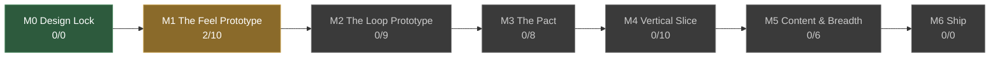

<!-- GENERATED BY tools/status.py — DO NOT EDIT BY HAND -->

# Project SHE — Status

<!-- generated-stamp --> _Regenerated 2026-08-15_

**Current milestone: M1 — The Feel Prototype**

> **Gate:** `pending` — *two people who aren't you play for 10 minutes and ask to keep playing.*

`2/43` tasks complete across the roadmap. Progress is **scope covered, never time remaining** (ADR-034).

## Milestones

| | Milestone | Progress | Done | Gates |
|---|---|---|---|---|
| ✔ | **M0** Design Lock | — | ✔ | `EXIT` passed 2026-08-14 |
| ▶ | **M1** The Feel Prototype ×1 | `██░░░░░░░░` | 2/10 | `EXIT` pending |
|  | **M2** The Loop Prototype ×1.5 | `░░░░░░░░░░░░░░░` | 0/9 | `EXIT` pending `COOP` pending |
|  | **M3** The Pact ×2 | `░░░░░░░░░░░░░░░░░░░░` | 0/8 | `EXIT` pending `COOP` pending |
|  | **M4** Vertical Slice unsized | `░░░░░░░░░░░░░░░░░░░░` | 0/10 | `EXIT` pending |
|  | **M5** Content & Breadth unsized | `░░░░░░░░░░░░░░░░░░░░` | 0/6 | `EXIT` pending |
|  | **M6** Ship not broken down | — | — | _no gate_ |

## Blockers

_None. Sequencing is clean._

## Warnings

| Check | Note |
|---|---|
| `untuned` | M1-T06 is done but TEC-004 still has 2 ⟨tune⟩ marker(s) |
| `untuned` | M1-T08 is done but TEC-002 still has 1 ⟨tune⟩ marker(s) |
| `untuned` | M1-T08 is done but TEC-001 still has 2 ⟨tune⟩ marker(s) |

## Tasks

### M1 — The Feel Prototype

- · `M1-T01` First-person controller: walk, sprint, crouch, stamina, weight affecting movement `DES-009` `DES-005`
- · `M1-T02` One weapon, one enemy, hit reactions, death `DES-009` `DES-013`
- · `M1-T03` One hand-built room set, no generation `DES-015`
- · `M1-T04` Weight & Clamor as visible debug numbers `DES-005`
- · `M1-T05` **Two players over localhost**, host-authoritative (`TEC-004`) `TEC-004`
- ✔ `M1-T06` **Networking spike test — go/no-go:** 4 peers, ~150 synchronized entities. This validates or kills the whole Godot high-level-multiplayer approach, and it must happen now rather than at M4. **GO (ADR-068)** — CPU never the constraint; bandwidth is, and relevance filtering is load-bearing `TEC-004`
- · `M1-T07` **Determinism harness in CI**: same seed on two processes → identical layout hash `TEC-001` `DES-015`
- ✔ `M1-T08` **Godot project skeleton** — folder layout, the ≤6 autoload budget enforced in CI (ADR-066), Forward+, naming and GDScript conventions, CI for the doc index and the dashboard. *The determinism harness is `M1-T07`'s deliverable, not this one (ADR-067)* `TEC-002` `TEC-001`
- · `M1-T09` **Ink shader spike** — grey boxes, outlines and boil only. **Go/no-go**: if it is not ~70% convincing, commit to flat quantised shading and never build the other path (ADR-062, ADR-064) `ART-005`
- · `M1-T10` **Shared humanoid rig with all six attachment sockets** — must exist before *any* character work; adding a socket later means re-exporting every mesh `ART-004` `DES-020`

### M2 — The Loop Prototype

- · `M2-T01` Loot with weight and clamor; inventory (prototype both models, Q23) `DES-008` `DES-005` `DES-019`
- · `M2-T02` The Hunt: clamor field, **the Gullsjúkr** (`DES-017` — wealth-sensing, gold-baiting, the whole point), escalation, the Sealing (`DES-005`) `DES-017` `DES-005`
- · `M2-T03` **The Ear + adaptive audio driver** (`DES-018`, ADR-035/036) — both channels together, from the first build `DES-018` `DES-019` `TEC-005`
- · `M2-T04` Extraction: reach an exit, keep what you carried `DES-005` `DES-002`
- · `M2-T05` Death: lose it all — plus **downed state and ember rescue** (`DES-012`) `DES-003` `DES-012`
- · `M2-T06` Minimal Lair: stash and re-descend `DES-014`
- · `M2-T07` **Party scaling instrumented from the first build**: per-capita extracted value at 1/2/4 players `DES-012`
- · `M2-T08` **Data schema base resources** — `ItemResource` + trait resources, stable string IDs, **plus the CI validator** (duplicate IDs, dangling refs, telegraph <250 ms, keystones with no effect tags). Built with the first ten resources, not the first thousand `TEC-006`
- · `M2-T09` **Threshold theme + adaptive driver prototype** — the emotional anchor and the highest-risk audio tech, both cheap to test early `ART-002` `ART-003` `TEC-005`

### M3 — The Pact

- · `M3-T01` Tribute → Boon → Aspects; **two Aspects complete. The other three are absent — not stubbed, not listed, not selectable** (ADR-064) `DES-003` `DES-004`
- · `M3-T02` **Two classes complete** — Húskarl and Veiðimaðr, opposite loop relationships. **The other four are absent from the class-select screen entirely.** A stubbed class a playtester can pick and that does nothing produces worthless feedback (ADR-064) `DES-011`
- · `M3-T03` **Boon cap by own rank** (ADR-011) — must exist before mixed-rank parties are tested `DES-003` `DES-012`
- · `M3-T04` Tithe and Pact Rank escalation (`DES-003`) `DES-003`
- · `M3-T05` Death → Legacy selection screen, with the "what you learned" panel first (ADR-006) `DES-003` `DES-019`
- · `M3-T06` Save system with versioning and migration from day one (`TEC-003`) `TEC-003`
- · `M3-T07` **Equipment slots and visible gear** — six slots, per-class bare arms, armour rendering over them, Pack driving grid size `DES-020`
- · `M3-T08` **Deeds awarded at the Settle beat** — never mid-run; the run must end on evidence of what you did `DES-016`

### M4 — Vertical Slice

- · `M4-T01` The Delvings: full generation from room modules, 3 floors `DES-015` `DES-006`
- · `M4-T02` ~6 enemy archetypes, 2 hazard types `DES-013`
- · `M4-T03` **Two classes**, fully polished — Húskarl and Veiðimaðr, opposite loop relationships. *The other four move to M5 (ADR-061).* `DES-011`
- · `M4-T04` Contracts tier 1–3, one faction (`DES-007`) `DES-007`
- · `M4-T05` Real art pass, real audio, real UI, ping system `ART-001` `ART-002` `DES-019` `DES-012`
- · `M4-T06` Full save/load, settings, controls rebinding `TEC-003` `DES-018`
- · `M4-T07` **Steam networking integration** (lobbies, invites, relay) — before any external playtest `TEC-004`
- · `M4-T08` **Ink shader, complete** — hatching (nested triplanar layers), the Threshold/Deep inversion, vertex-colour authoring across the asset library `ART-005`
- · `M4-T09` **Composer onboarded; first full stem set** — brief handed over as-is, stems authored to one tempo and key `ART-003`
- · `M4-T10` **Phase 2→3 asset production** — real models replacing blockout, per the schedule and specs `ART-004`

### M5 — Content & Breadth

- · `M5-T01` **The remaining four classes** — moved here by ADR-061; all six are required for launch (ADR-012) `DES-011`
- · `M5-T02` Remaining biomes — Barrow-Fields, Sunken Wood `DES-006` `DES-015`
- · `M5-T03` Remaining factions and Aspects `DES-007` `DES-004`
- · `M5-T04` Full enemy roster and modifier set `DES-013`
- · `M5-T05` **Design and build onboarding / the first hour** — `DES-010` C1 is the largest absolute churn point. *Produces a new design doc; deliberately not written yet (ADR-065) — it is not needed to start development, and a reference to a document that does not exist is itself a stub.* `DES-010` `PRO-005`
- · `M5-T06` Balance passes against real telemetry, at every party size `DES-022`

---

_39 docs (39 accepted) · 69 ADRs · 15 open questions · 77 ⟨tune⟩ markers._

Regenerate with `python3 tools/status.py --write`. Source of truth is [PRO-001](process/PRO-001-roadmap-and-milestones.md) (ADR-063).
